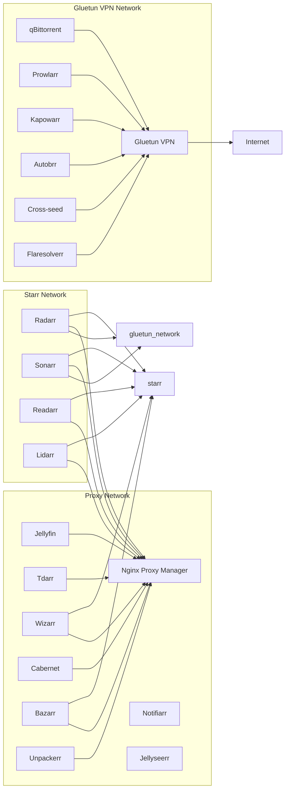

# 🎬 Ultimate Media Server Stack

Welcome to the Ultimate Media Server stack! This Docker Compose setup features a full media ecosystem — Jellyfin, Radarr, Sonarr, Lidarr, Readarr, Prowlarr, qBittorrent, Gluetun VPN, and many more — all orchestrated for easy deployment.

---

## 🖼️ Architecture Diagram

🔧 Setup Instructions
1️⃣ Initialize Docker Networks

Create a file named init-networks.sh with the following content and run it to create all necessary external Docker networks:

#!/bin/bash
set -e

echo "Creating Docker external networks..."

docker network create proxy || echo "Network 'proxy' already exists"
docker network create starr || echo "Network 'starr' already exists"
docker network create jellystat || echo "Network 'jellystat' already exists"
docker network create gluetun_network || echo "Network 'gluetun_network' already exists"

echo "Docker networks initialized!"

Run:

chmod +x init-networks.sh
./init-networks.sh

2️⃣ Configure Environment Variables

Create a .env file to store all environment variables like PUID, PGID, TZ, VPN keys, and IP addresses referenced in docker-compose.yml.

Example .env:

PUID=1000
PGID=1000
TZ=Europe/London
WIREGUARD_KEY=your_wireguard_private_key
WIREGUARD_ADD=10.0.0.2/32
VPN_SERVER_COUNTRIES=US
PUBLICIP_API=ipify
PUBLICIP_TOKEN=your_token
FREE_ONLY=false

RADARR_IPV4=172.18.0.10
SONARR_IPV4=172.18.0.11

BASE_PATH=/path/to/appdata
MEDIA_SHARE=/path/to/media

3️⃣ Replace Nginx Proxy Manager with Nginx + SSO (Authelia)

    We recommend setting up your own Nginx reverse proxy for more control.

    Integrate Authelia for single sign-on (SSO) and 2FA security.

    Example config and setup can be found in /docs/nginx-authelia-setup.md (you'll need to create this).

4️⃣ Cloudflare DNS & SSL Configuration

    Use Cloudflare DNS to manage your domains.

    Enable Cloudflare SSL with “Full (strict)” mode for secure connections.

    Set up Cloudflare Tunnel if needed.

    Don’t forget to whitelist your Cloudflare IPs if you enable firewall rules.

5️⃣ Additional Services to Add

    Notifiarr for notifications about media.

    Whisparr for managing whisper notifications.

    Uptime Kuma for service monitoring.

    Blog server (Ghost) on blog.domain.com to host your blog seamlessly.

🧱 Services Overview
Service	Description	Network(s)
Nginx Proxy Manager	Reverse proxy UI (replace with Nginx + Authelia)	proxy
Jellyfin	Media server	proxy, starr
Radarr	Movie management	proxy, starr, gluetun_network
Sonarr	TV series management	proxy, starr, gluetun_network
Lidarr	Music management	proxy, starr
Readarr	Books management	proxy, starr
Prowlarr	Indexers manager	gluetun_network
qBittorrent	Torrent client	gluetun_network
Gluetun	VPN container	proxy, starr, gluetun_network
Notifiarr	Notifications	proxy
Authelia	SSO & 2FA	proxy (self-hosted, add)
Bazarr	Subtitles	proxy, starr
Tdarr	Video transcoding	proxy
Cross-seed	Torrent seeding	gluetun_network
Jellyseerr	Jellyfin companion UI	proxy, starr
Unpackerr	Auto extraction	proxy
Dozzle	Docker log viewer	host
Cabernet	Media health & analytics	proxy
Autobrr	Auto torrent downloader	gluetun_network
Kapowarr	Automation & notifications	gluetun_network
Flaresolverr	Captcha solver	gluetun_network
Wizarr	Media discovery & stats	proxy, starr
💡 Tips

    Use Docker Compose override files to customize services without touching main compose file.

    Keep your media mounts clean and consistent.

    Regularly back up your configs.

    Monitor VPN status inside Gluetun to avoid leaks.

    Integrate Uptime Kuma to keep tabs on all service uptime.

📚 Resources

    Gluetun VPN GitHub

    Authelia SSO Documentation

    Cloudflare DNS & SSL

    Ghost Blog

License

MIT License © 2025 YourName

Made with ❤️ by Media Server Enthusiasts

